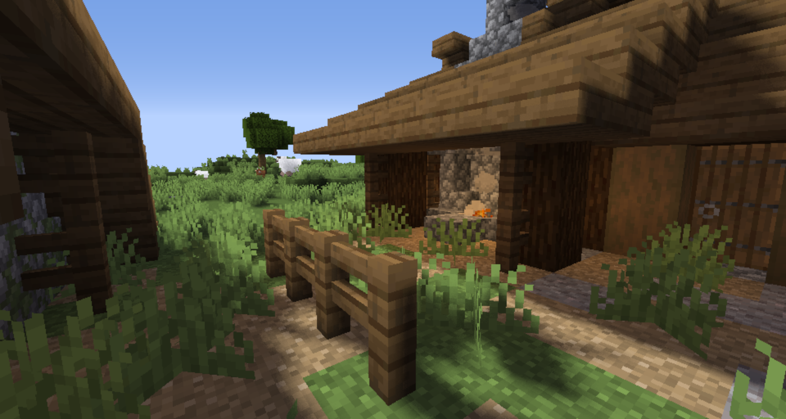
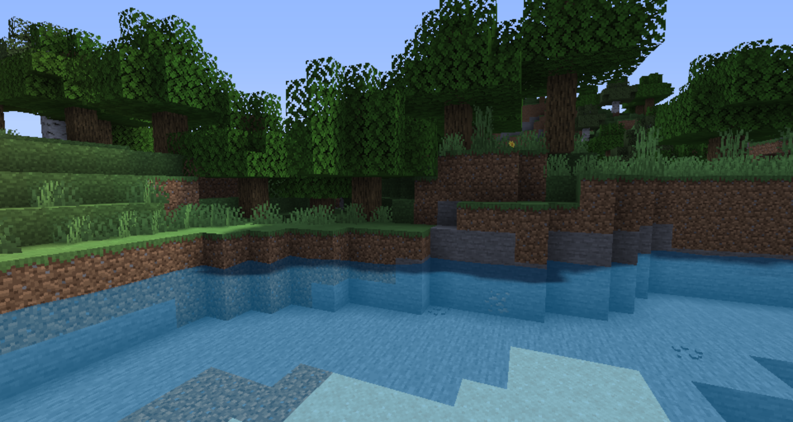

# Overhaul Shader
A realistic rendering shader that tries to implement as much as possible from high-end OptiFine shaders like SEUS and Continuum to the while still maintaining decent performace. Due to my limited knowledge, most advanced features are not yet implemented.

Current functionality includes:
- Optimized, high quality shadows
- Colored shadows
- Realistic blocklighting
- Time based shadow sharpness
- Basic ambient occlusion

Planned functionality includes:
- Screen space ambient occlusion
- Realistic skies
- Volumetric fog
- Light shafts
- Realistic water
- Block refelctions

# Current stage of the project

