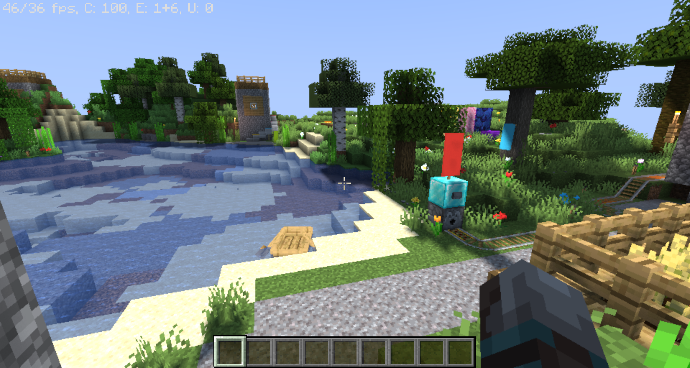

# Overhaul Shader
A high performance shader that adds as much as possible from high-end OptiFine shaders to the while still maintaining high performace. Due to my limited knowledge, most advanced features are not yet implemented.

Planned functionality includes:
- Optimized, high quality shadows
- Tonemaps
- Volumetric clouds
- Realistic water
- Block and fluid refelctions
- QOL changes!

# Current stage of the project

