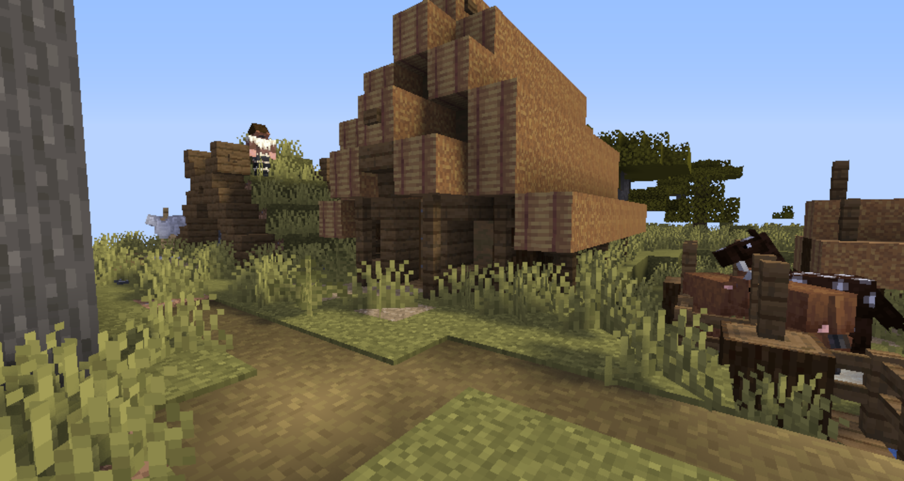

# Optifine shader testing
A basic shader for Optifine. Lacks most decent features of the good shaders. Looks pretty bad and IS NO LONGER MAINTANED. Use with caution.

NOTE: For some reason this gives very good performance. It runs at about 45 FPS on an Intel iGPU (HD 520 to be specific)

Current functionality includes:
- Optimized, high quality shadows
- Colored shadows
- Realistic blocklighting
- Time based shadow sharpness
- Basic ambient occlusion

# Current stage of the project

